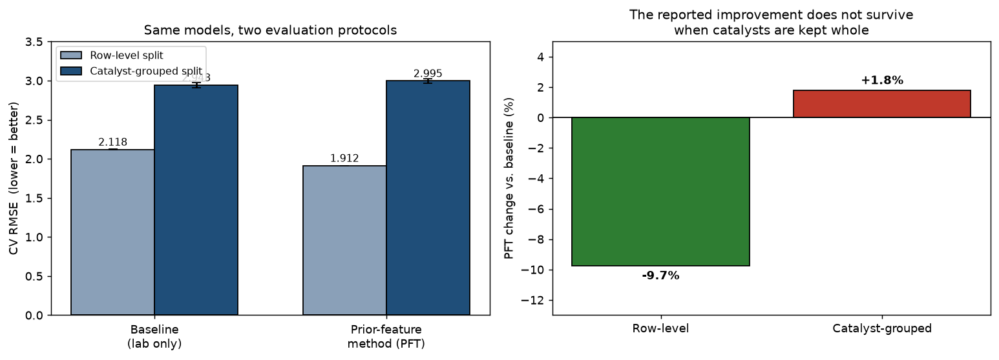
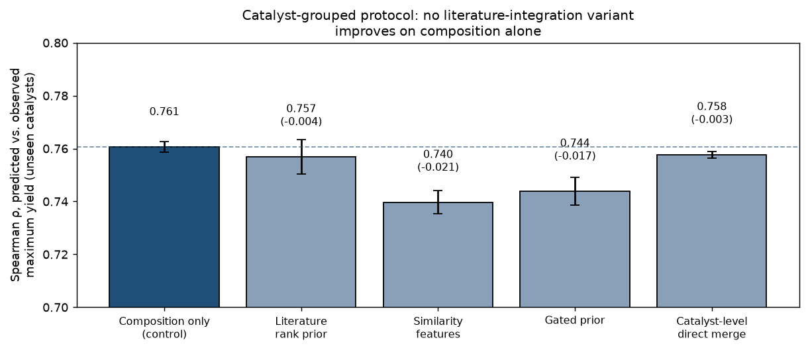
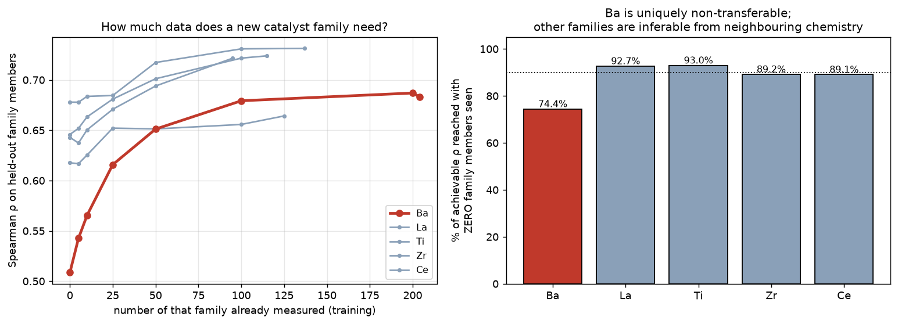

# Work Note (v2) — Incorporating Published Literature Data into the Lab OCM Yield Model

**To:** Prof. Taniike
**Topic:** A domain-adaptation study for C₂-yield prediction in Oxidative Coupling of Methane (OCM)
**Supersedes:** version 1 of this note. **Companion code:** `ocm_methodology.ipynb`,
`taniike_validation.py`, `phase3_lit_prior.py`, `phase4_family_diagnosis.py`,
`phase5_target_audit.py`, `phase6_our_experiments.py`, `phase6_candidates.py`

---

## What changed since version 1

Version 1 reported that a two-stage prior-feature method ("PFT") improved C₂-yield prediction by
about 10 % over a lab-only baseline. **Following the stricter validation Prof. Taniike proposed, that
improvement does not survive, and we withdraw the claim.**

| Claim in v1 | Status in v2 |
|---|---|
| PFT improves CV RMSE by ≈10 % | **Withdrawn.** The gain was catalyst-identity leakage; under catalyst-grouped CV, PFT is 1.8 % *worse* than baseline |
| Literature data measurably helps the lab model | **Not demonstrated.** Four honest designs, all ≤ the composition-only control |
| Quantile normalisation is a necessary component | **Unnecessary.** Quantile-normalised ≈ raw ≈ rank priors (0.001–0.005 RMSE apart) |
| — | **New:** the composition-only model screens *unseen* catalysts usefully (ρ = 0.761, enrichment 3.04–4.89×) |
| — | **New:** the Ba-family failure is mechanistically explained, and yields a data budget for new chemistry |

The cause was specific and is now understood: our Stage-1 expert was trained on literature data
*together with the lab training rows*, so under a random row split it had seen the very catalysts it
was later asked to help predict. What follows is the corrected study.

## 1. Objective

We predict C₂ yield from catalyst composition using the lab's own data (89,074 measurements, 2025,
impregnation route). A body of published literature data (3,852 measurements, 1982–2019) is also
available. The question is whether the literature can improve the lab model without degrading it.

Two distributional differences make this a **domain-adaptation** problem: a **label shift** (literature
mean 8.670 % vs. lab 5.245 %, a +3.425 pp gap reflecting publication practice) and a **covariate
shift** (the two collections emphasise different chemistry).

## 2. Evaluation methodology

**Catalyst-grouped cross-validation is now our default protocol.** All measurements of a given
catalyst are assigned to exactly one fold, so every reported number answers: *how well do we predict
a catalyst nobody has made yet?* Anything fitted on data — scaler, domain classifier, both model
stages — sees training-fold data only.

**Why the previous protocol was inadequate — a quantitative argument.** The 89,074 measurements
comprise only **917 distinct catalysts** at 5 temperatures, giving ~4,400 unique input vectors each
measured ~20 times. Because roughly 27 reaction-condition variables are not recorded as features,
those repeats are *identical inputs with differing yields*. That within-group variance is **18.2 % of
total yield variance**, so the best attainable row-level RMSE is **1.680**.

Version 1 reported 1.912 — only 0.23 above that floor. In hindsight this should itself have prompted
suspicion: a model cannot approach the noise ceiling of data it should not be able to memorise.
Point-wise RMSE is therefore not merely less relevant than catalyst-level metrics here; it is close to
uninformative.

**Primary metrics** are consequently catalyst-level, as proposed: Spearman correlation between
predicted and observed *maximum* yield, and enrichment of true high performers among top-ranked
predictions.

## 3. Baseline and the two datasets

A LightGBM regressor trained on lab data only. Under the grouped protocol its CV RMSE is **2.943**
(row-level: 2.118 — the difference is the leakage, not a change of model).

## 4. Approaches evaluated

**Direct merge.** Pool all literature records with the lab data. The label shift enters the training
target and accuracy is not improved.

**Selective merge.** Make the literature more lab-like before merging — either a hard filter (DRST: a
logistic-regression domain classifier scoring each record by `P(lab | features)`, retaining 20.3 % at
τ = 0.30) or continuous importance weights (KMM). Both still place literature yields in the training
objective, so the label shift is unresolved.

**Prior-feature method (PFT).** Let the literature influence the final model only through a *predicted
value used as an input feature*, never as a training label: Stage 1 trains an expert on literature
data whose yields are rank-rescaled onto the lab scale; Stage 2 trains on lab data with that
prediction as one extra feature, using lab labels only.

## 5. What the stricter validation showed

**The improvement was leakage.** Under catalyst-grouped CV: baseline **2.943**, PFT **2.995** (+1.8 %).
Three independent checks establish the mechanism:

1. Training Stage 1 on literature *alone* reduces the row-level gain from −9.7 % to **−2.6 %**
2. Under grouped CV the joint variant (**2.982**) is *worse* than literature-only (**2.938**)
3. Literature-only under grouped CV (2.938) is indistinguishable from baseline (2.943)

**Your quantile-normalisation hypothesis was correct, and the effect is essentially exact.**
Quantile-normalised, raw-yield and pure-rank priors differ by only 0.001–0.005 RMSE under both
protocols. The Stage-2 trees consume only the prior's ordering, so the normalisation step can be
removed with no loss.

**With the leakage channel closed, we retested literature integration properly** — a literature-only
rank prior, similarity-to-literature features, a gated prior combining both, and a catalyst-level
direct merge. Success criteria were fixed before running. **None improved on composition alone.**

We also tested a hypothesis of our own — that the prior might help specifically where our own
coverage is thin, suggested by one family (Zr) showing a consistent gain. Across **all 28 element
families with ≥50 catalysts** the mean effect was **−0.0025**, 14/28 positive, and the strongest
correlation with any coverage measure was |ρ| = 0.276 against a pre-registered threshold of 0.5. The
Zr result was selection from noise, and we discarded it.

## 6. What the model can do: screening unseen catalysts

Rebuilt at catalyst level — composition → maximum yield, 917 training examples, no temperature — the
model matches the full 89,074-row model on ranking while training ~100× faster. On genuinely unseen
catalysts:

| Metric | Value | 95 % CI |
|---|---|---|
| Spearman ρ (predicted vs. observed max yield) | 0.761 | 0.725 – 0.785 |
| Enrichment of true top-decile among top-decile predicted | 4.28× | **3.04 – 4.89×** |
| Precision@20 (of 20 nominated, fraction truly top-decile) | 0.44 | **0.15 – 0.65** |

We quote intervals rather than point estimates: with ~18 catalysts in a test decile, these
quantities are considerably less precise than a single number suggests.

## 7. Why the Ba family fails, and how much data a new family needs

Family holdouts behave reasonably for La, Ti, Zr and Ce (ρ 0.62–0.68) but poorly for Ba (0.526). The
cause is quantifiable: Ba catalysts average **13.76 %** maximum yield against **8.95 %** for the rest,
and **78 % of the lab's top decile contains Ba**. Removing them removes the high-yield regime itself.

The mechanism is provable rather than inferred. With no Ba catalysts in training, the Ba column is
constant, so no tree splits on it — and retraining with that column **deleted entirely** produces
**bit-identical predictions**. The model prices Ba catalysts as though Ba were absent, underpredicting
the best of them by **9.8 yield points**. Ten random pseudo-families of equal size score 0.752, so
this is chemistry and label coverage, not sample size.

That raised a question we found more useful than *whether* it fails: **how many labelled members of a
family are needed before the model can price it?**

| Family | ρ, none seen | ρ, fully seen | % of ceiling at zero |
|---|---|---|---|
| **Ba** | 0.509 | 0.683 | **74.4 %** |
| La | 0.678 | 0.731 | 92.7 % |
| Ti | 0.618 | 0.664 | 93.0 % |
| Zr | 0.646 | 0.724 | 89.2 % |
| Ce | 0.643 | 0.722 | 89.1 % |

Ba is uniquely non-transferable: the other families are already at 89–93 % of their ceiling having
never seen a member, because neighbouring chemistry carries the information. Ba's curve is still
rising at n = 200 while the others saturate near n ≈ 50. **As a practical budget: a chemically
distinctive new promoter family requires roughly 50–100 labelled catalysts before it can be modelled;
a family resembling existing chemistry requires 10–25.**

## 8. A candidate list for prospective validation

We enumerated **26,414 unseen candidates** in the laboratory's own design grammar — impregnation, one
support at ~90 % with 2–3 promoters at ~3.33 %, drawn from the supports and promoters already in use —
and scored them with a 10-seed ensemble. No literature prior is used.

Every candidate carries a coverage flag, and the safeguard is verified rather than assumed: for an
element absent from our data (Ag), predictions computed with and without its column differ by exactly
zero — confirming such candidates are unpriceable and must be flagged rather than ranked.

The highest-ranked candidate is **Ba(90) + Mo(3.33) + Zn(3.33) + Fe(3.33)**, predicted 18.79 % ± 0.09.

Two caveats. Absolute predictions compress at the extreme — our ensemble maximum is 18.79 % while
observed training yields reach 21.50 % — so the **ranking** is the deliverable, not the predicted
value. And the top 20 are chemically monotonous: all contain Ba, most contain Mo. A diversity
constraint did not meaningfully change this, because the model's preference for Ba is genuine. We
therefore also provide the best candidate per support, with its cost in predicted yield:

| Support | Ba | Ti | La | Ca | Mg | Si | Al | Zr | Ce |
|---|---|---|---|---|---|---|---|---|---|
| Best predicted max yield (%) | 18.79 | 16.49 | 15.82 | 15.54 | 14.66 | 13.83 | 13.63 | 13.02 | 12.93 |

Whether a campaign should concentrate on the Ba/Mo optimum or spread across supports is a judgement
we would rather leave to the laboratory: twenty near-identical catalysts test one hypothesis twenty
times, but the alternative sacrifices predicted yield.

## 9. Relation to prior work

The mechanism of PFT — using a model's prediction as an input feature — is **stacked generalisation**
(Wolpert, *Neural Networks* 5, 1992, 241–259) applied across distributions. "Prior Feature Transfer"
was our internal shorthand, not a standard term, and we note that "feature transfer" usually denotes
*representation* transfer, which this is not.

**Our corrected understanding of when such a method can help.** Because the prior `p = f(x)` is a
deterministic function of features the final model already has, `I(y; x, f(x)) = I(y; x)` — it cannot
add information. It can only supply an inductive bias, or exploit source data covering regions the
target data does not. Our results indicate neither applies here at the scale that matters, for three
reasons: ~78.5 % of the literature is out-of-distribution relative to the lab; quantile normalisation
aligns marginal but not conditional distributions; and literature yields are measured under each
paper's own conditions, whereas our target is the maximum over a standardised battery — semantically
different quantities. **The honest scope statement is that this family of methods is a local-coverage
tool, not a global-information tool.**

Related approaches remain distinct: Δ-machine-learning (Ramakrishnan et al., *JCTC* 11, 2015, 2087)
adds a source estimate as an additive baseline, inheriting its scale; importance weighting (Huang et
al., NIPS 2006; Sugiyama et al., *JMLR* 8, 2007) corrects which records are used but keeps source
labels in the objective — our DRST and KMM baselines are instances; label-shift correction (Lipton et
al., ICML 2018) reweights to correct the label distribution.

## 10. Limitations and next steps

- **The literature contribution is not demonstrated.** Four designs plus a 28-family follow-up all
  returned null. We report this rather than continue searching for a variant that scores well.
- **Novel promoter families cannot be priced.** This is structural, not a modelling deficiency — but
  §7 quantifies the data required to remove the limitation.
- **The target carries a measurement-effort confound.** 47 catalysts have fewer than 20 measurements
  and systematically low maxima; part is a pure sampling effect, part appears to be deliberate early
  stopping. Excluding them changes our headline metric by 0.002, so nothing hinges on it — but we
  would welcome confirmation of which it is.
- **The unrecorded reaction conditions are the largest single opportunity.** If those ~27 variables
  exist in a retrievable form, the 18.2 % irreducible variance becomes partly learnable and
  condition-level modelling becomes meaningful.
- **Cross-preparation transfer remains to be re-tested** under the corrected protocol.
- **Prospective validation** is the natural next step, and we would pre-register the expected hit rate
  (precision@20, CI 0.15–0.65) before any results arrive.

*All numbers in this note are stored outputs of the scripts named at the head of the document; each
figure is generated from the corresponding experiment's JSON so that figures cannot drift from the
experiments that produced them.*
