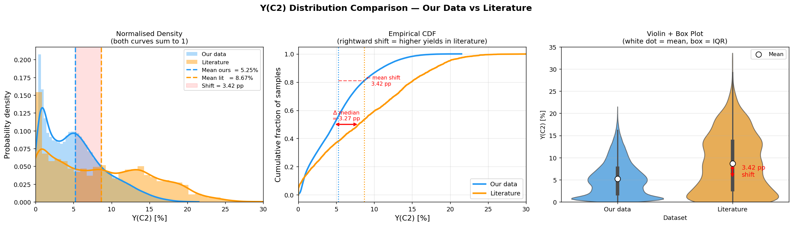
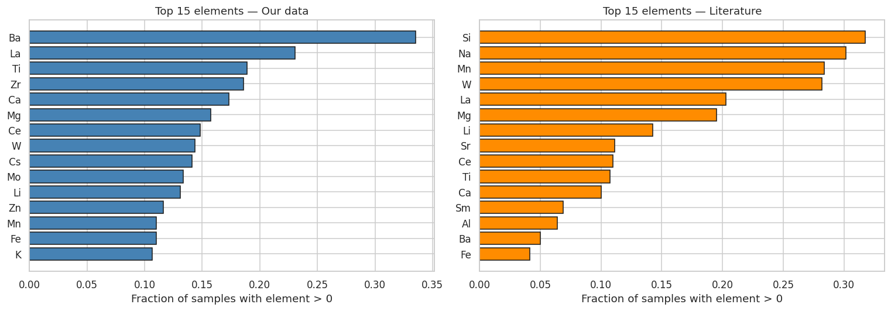
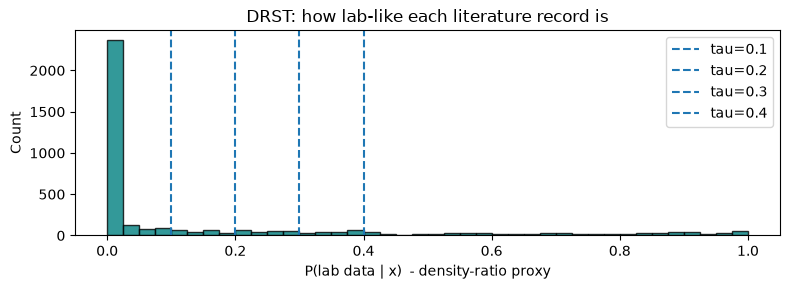
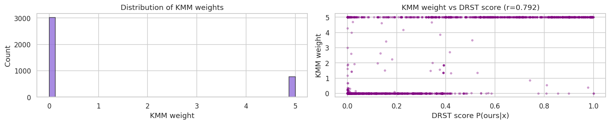
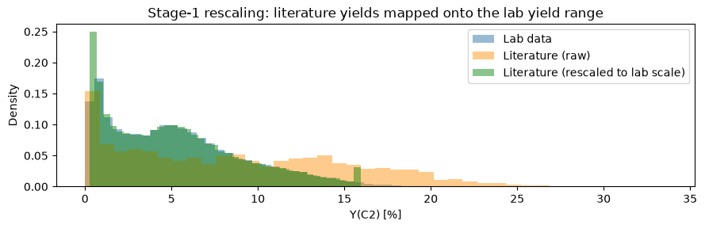
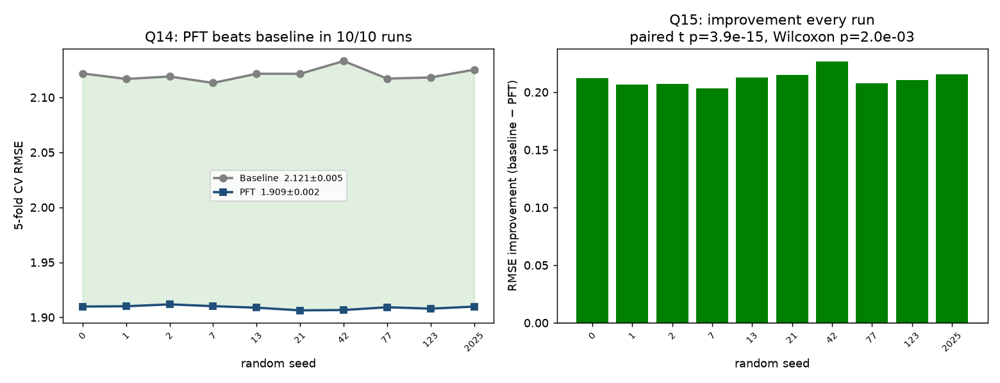
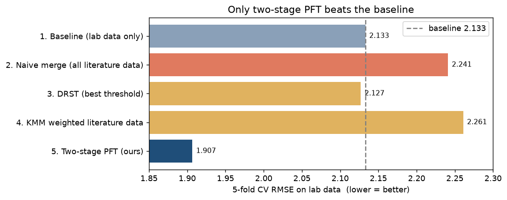

# Work Note — Incorporating Published Literature Data into the Lab OCM Yield Model

**To:** Prof. Taniike
**Topic:** A domain-adaptation approach for C₂-yield prediction in Oxidative Coupling of Methane (OCM)
**Companion notebook (all code, reproducible):** `ocm_methodology.ipynb`

---

## 1. Objective

We maintain a machine-learning model that predicts C₂ yield from catalyst composition, trained on the
lab's own **lab data** (89,074 in-house experiments, 2025, impregnation route). A large body of
**literature data** (3,852 published experiments, 1982–2019) is also available. The objective of this
work is to determine whether, and how, the literature data can be used to **improve the accuracy of the
lab-data model without degrading it**.

Two well-understood distributional differences make this a **domain-adaptation** problem — the same
prediction task, but two datasets drawn from different distributions:

- **Label shift.** The literature reports a mean C₂ yield of **8.670 %** versus **5.245 %** in the lab — a
  systematic **+3.425 percentage-point** difference. This reflects the different operating conditions and
  reporting practices of published work (published studies tend to report high-yield results), and is a
  property of the two collections, not an error in either.
- **Covariate shift.** The two datasets emphasise different elements and preparation methods, so they
  occupy overlapping but distinct regions of catalyst-composition space.

Combining the two therefore requires care: if the higher published yields are used directly as training
targets, they shift the model's predictions upward. This note evaluates the established options for this
situation and describes the approach we adopted.

## 2. Evaluation methodology (applied identically to every method)

Every method is compared under one protocol so the numbers are directly comparable:

- **Asymmetric 5-fold cross-validation.** The 89,074 lab records are split into 5 folds; each is held out
  for testing once while the model trains on the other four. **Literature data, when used, enters only the
  training side — never the test fold.** Every reported number therefore answers the same question: *how
  accurately does the model predict the lab's own experiments?*
- **Metric.** Root-mean-square error (RMSE) of C₂ yield, in yield-% units; lower is better.
- **Reproducibility.** For the sake of repeatable experiments, all random splits and model seeds are fixed,
  hyper-parameters are held constant across every method (no per-method tuning), and each headline result
  is repeated across 10 independent random seeds (Section 5). Every value in this note is a stored output
  of `ocm_methodology.ipynb`.

## 3. Baseline and the two datasets

**Baseline model.** A LightGBM gradient-boosted-tree regressor trained on lab data only — input: 67 catalyst
features (temperature, preparation code, 65 element loadings); output: predicted C₂ yield. **CV RMSE =
2.133.** This is the reference every subsequent method must improve upon.

The two distributional differences that shape the study are shown below.

## 4. Approaches evaluated

We first evaluated the established options for combining datasets of this kind, then developed the method we
adopted. The established options are described briefly; the adopted method (Section 4.3) is described in
full.

### 4.1 Direct merge — a reference point

Pool all 3,852 literature records with the lab data and train a single LightGBM. Because the literature
carries the +3.4-point label shift, using its yields directly as training targets moves the combined model's
predictions upward, and accuracy is not improved. **CV RMSE = 2.241.** This shows that the two datasets
cannot simply be concatenated as-is — the label shift needs to be handled — which motivates the selective
approaches below.

### 4.2 Selective merge — filtering (DRST) and weighting (KMM)

A natural refinement is to make the literature more representative of the lab's chemistry before merging.
This is the standard covariate-shift toolkit, in two forms:

- **DRST (hard filter).** A logistic-regression domain classifier scores each literature record by how much
  its chemistry resembles the lab data, `P(lab | features)`; records above a threshold are kept. At
  **τ = 0.30** this retains **782 / 3,852 = 20.3 %** of the literature. *(LogReg selector → LightGBM.)*
- **KMM (soft weighting).** Kernel Mean Matching assigns every literature record a continuous importance
  weight so the weighted literature distribution matches the lab distribution. *(KMM weights → weighted
  LightGBM.)*

**Result.** Best DRST **CV RMSE = 2.127**; KMM **CV RMSE = 2.261** — both close to, and not better than, the
baseline. Correcting *which* records are used addresses the covariate shift, but these methods still use the
literature's yields as training targets, so the label shift is not resolved.

**Reading of Sections 4.1–4.2.** Every approach that places the literature yields into the training objective
is limited by the label shift. The open question is whether the literature's *chemical information* can be
used without its *yields* entering the objective. That is what the adopted method does.

### 4.3 Adopted method — a two-stage prior-feature approach (stacking-based domain adaptation) ★

**Core idea.** Let the literature influence the final model **only through a predicted value used as an input
feature**, never as a training label. Concretely, three stages:

- **Stage 0 — (optional) selection.** Choose the literature used to build the expert: either the
  DRST-filtered subset (782 records, τ = 0.30) or all 3,852 records. We tested both (Section 4.4); the
  choice makes a negligible difference, so this stage is optional.
- **Stage 1 — literature expert.** Train an XGBoost regressor on the chosen literature. Its published yields
  are first **rank-rescaled onto the lab yield range** (quantile normalisation — a monotone, rank-preserving
  map), so the expert's outputs are expressed on the lab scale. *(Input: literature catalyst features;
  output: an expert yield estimate.)*

- **Stage 2 — final model.** Train a LightGBM on the lab data, adding the Stage-1 expert's prediction as one
  additional input feature, `lit_prior_prediction`, and training on **lab labels only**. The literature's
  yields never enter this model's objective.

**Why this addresses the label-shift limitation.** The literature's scale now resides in a *feature value*,
which the final model can weight, discount, or recalibrate per sample using the lab data — rather than in the
training target. The systematic offset is contained within a feature instead of propagating into the
objective.

**Result. CV RMSE = 1.907 — a 10.6 % improvement over the baseline**, and the only approach evaluated that
improves on it.

### 4.4 Does the Stage-0 filter matter? Filtered vs. all literature

Because Stage 2 uses the expert only as a feature it can down-weight, the expert can be built from **all**
literature — including records whose chemistry is unlike the lab's. We compared both, across 10 seeds:

| Stage-1 training data | CV RMSE | MAE | R² |
|---|---|---|---|
| DRST-filtered (782, 20.3 %) | **1.909 ± 0.002** | 1.386 | 0.765 |
| All literature (3,852) | **1.917 ± 0.002** | 1.395 | 0.763 |

Both improve on the baseline on **10 / 10** seeds; the filter contributes only a **0.008 RMSE (~0.4 %)**
edge. This answers a useful question — *how can information be drawn from records that do not look like the
lab's data?* The gain comes from the two-stage design rather than the filter, and the method is **robust to
including literature unlike the lab's chemistry**: because that information arrives as a *feature* (not a
label), the final model weights it appropriately per sample instead of being pulled off-scale. Stage 0 is
therefore optional; we report the filtered variant as the primary result and note the all-literature variant
is essentially equivalent.

## 5. Robustness of the result

- **Repeatability across 10 seeds.** Baseline **2.121 ± 0.005** vs. adopted method **1.909 ± 0.002**; the
  method improves on the baseline on **10 / 10** seeds, with a paired t-test **p ≈ 4 × 10⁻¹⁵**.

- **Held-out test, used nowhere in the pipeline.** A random 20 % of the lab data (17,814 records) was set
  aside at the outset and used in **no** part of the pipeline — not the domain classifier, not Stage 1, not
  Stage 2 (verified by rebuilding the domain classifier on the training portion only). On this untouched set:
  baseline RMSE **2.097** → adopted method **1.890** (R² = 0.763) — the same ~10 % improvement, confirming
  the result is not an artefact of the cross-validation splits.

## 6. What drives the improvement

Using SHAP (a standard feature-attribution method), the engineered feature `lit_prior_prediction` — the
literature expert's estimate — is the **most influential input by a wide margin** (roughly an order of
magnitude above the next feature), followed by chemically sensible drivers (temperature and known OCM
promoters such as Ba, Mn, La, Ce). This confirms that the transferred chemical information, delivered as a
feature, is what produces the gain.

## 7. Relation to prior work and our contribution

The individual ingredients are established; **the contribution here is the specific pipeline and its
application.**

- **Positioning.** Because the lab and the literature share the *same* prediction task and differ only in
  distribution, this is a **domain-adaptation** problem (a sub-field of transfer learning), not transfer to a
  new task. Using a model's *prediction as an input feature* is **stacked generalisation** (Wolpert, *Neural
  Networks* 5, 1992, 241–259) applied across distributions — a documented family sometimes termed *stacked
  transfer learning*. The mechanism is therefore not itself new.
- **On the name.** We use "Prior Feature Transfer (PFT)" only as an internal shorthand; it is not a standard
  term. We note that "feature transfer" in the literature usually denotes *feature-representation* transfer
  (learning a shared feature space), which is **not** what this method does. A precise description is
  *stacking-based domain adaptation using a literature-derived prior feature* (a clear alternative name would
  be "Literature-Prior Stacking").
- **Distinctions from related methods.**
  - *Δ-machine-learning / multi-fidelity* (Ramakrishnan, Dral, Rupp, von Lilienfeld, *J. Chem. Theory
    Comput.* 11, 2015, 2087) combines a source estimate with a learned correction as
    `final = source_estimate + Δ`, so the source value is added into the output and its scale is inherited.
    Our method instead supplies the source estimate **only as a feature** the final model may weight or
    ignore.
  - *Importance weighting for covariate shift* (Huang, Gretton, Borgwardt, Schölkopf, Smola — KMM, NIPS
    2006; Sugiyama, Krauledat, Müller, *JMLR* 8, 2007, 985) corrects which records are used but keeps the
    source labels in the objective — our DRST and KMM baselines are instances, which is why they do not
    overcome the label shift.
  - *Label-shift correction* (Lipton, Wang, Smola — BBSE, ICML 2018) reweights examples to correct the label
    distribution; our method keeps the source labels out of the objective entirely.
- **What is genuinely ours (an applied/methodological contribution):** the specific pipeline — *(optionally)
  select literature by chemistry → build an expert whose yields are rescaled to the lab scale → use its
  prediction as the sole channel into a lab-labelled final model* — applied to **OCM literature→lab yield
  transfer under simultaneous covariate and label shift**, together with the empirical finding that it is the
  only evaluated approach to improve on the baseline, verified across 10 seeds and on an untouched held-out
  set.

## 8. Results summary

| # | Approach | Model(s) | Literature used as | CV RMSE | vs. baseline |
|---|---|---|---|---|---|
| 1 | Baseline (lab only) | LightGBM | — | 2.133 | — |
| 2 | Direct merge | LightGBM | training labels | 2.241 | +5.1 % |
| 3 | Selective merge — DRST filter | LogReg → LightGBM | filtered training labels | 2.127 | ≈ 0 % |
| 3 | Selective merge — KMM weights | KMM → LightGBM | weighted training labels | 2.261 | +6.0 % |
| 4 | **Prior-feature method (adopted)** | **XGBoost → LightGBM** | **a predicted feature** | **1.907** | **−10.6 %** |

## 9. Limitations and next steps

- **Operating regime.** The improvement is established for prediction on lab-like chemistry (the lab's
  operating regime). Predicting *very different* catalyst families (out-of-distribution) is a separate
  objective; a preliminary check indicates that the current rescaling — tuned to the lab yield range — does
  not by itself improve out-of-distribution accuracy. Extending the method for that use-case (e.g. building
  the expert from all literature and retaining the literature scale) is a direction we will examine next.
- **Domain knowledge.** Incorporating explicit chemical or process knowledge — for example known promoter
  groupings, or reaction-condition variables such as gas hourly space velocity and CH₄:O₂ ratio (not present
  in the current dataset) — is a promising avenue for a future iteration.
- **Reproducibility.** All hyper-parameters were fixed across every method (LightGBM `num_leaves = 63`,
  `max_depth = 7`; XGBoost `max_depth = 6`), with no validation-set tuning; all results are stored outputs of
  `ocm_methodology.ipynb`.
