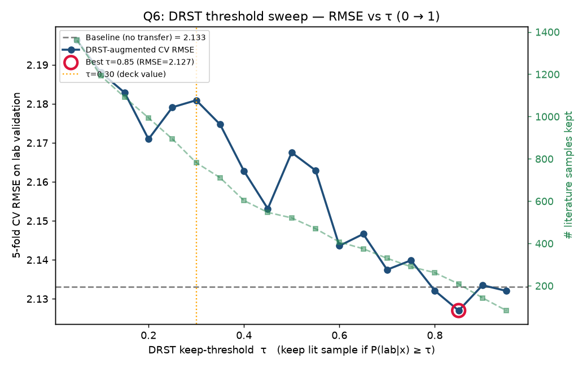

# Work Note — Using Published Literature Data to Improve Our Lab-Data OCM Model

**To:** Prof. Taniike **· Topic:** Transfer learning for C₂-yield prediction in Oxidative Coupling of Methane (OCM)
**Companion notebook (all code, fully re-runnable):** `ocm_methodology.ipynb`

---

## 1. The problem in one paragraph

We have two sources of catalyst data. **Lab data** — 89,074 experiments from our own group (year 2025,
impregnation catalysts). **Literature data** — 3,852 experiments collected from 40 years of publications
(1982–2019). We want to use the literature data to make our lab-data yield model *more accurate*, **without
making it worse**. This is hard for two reasons:

- **The yields don't line up (label shift).** Published catalysts report a mean C₂ yield **3.4 percentage
  points higher** than ours (5.25 % vs 8.67 %). This is publication bias — good results get published.
- **The chemistry is different (covariate shift).** The literature explores different elements and preparation
  methods than our lab uses.

If we naively mix the two, the higher published yields drag our model's predictions upward and it gets
*worse*. The rest of this note describes the five methods we tried, in order, and why only the last one works.

**How we score every method.** 5-fold cross-validation, but with one rule: the model is **always tested on
lab data only** (literature data may only ever be used to help *train*). So every number answers the same
question — *how accurately do we predict our own experiments?* Accuracy is reported as **RMSE** (root-mean-
square error, in yield-% units); **lower is better**. All numbers below come from re-running the companion
notebook — nothing is hand-entered.

---

## 2. The five methods

### Method 1 — Baseline (the number to beat)

1. **Method.** Train only on lab data; ignore the literature entirely.
2. **Model.** LightGBM (a gradient-boosted decision-tree regressor). **Input:** 67 catalyst features
   (temperature, preparation type, 63 element loadings). **Output:** predicted C₂ yield.
3. **Why.** It sets the reference accuracy every transfer method must improve upon.
4. **Result.** **RMSE = 2.133.**

### Method 2 — Naive merge (the obvious idea, and why it fails)

1. **Method.** Pool all 3,852 literature-data rows with the lab data and train one model.
2. **Model.** LightGBM. **Input:** lab data + all literature data (with their published yields).
   **Output:** predicted C₂ yield.
3. **Why / why worse.** The natural first attempt. But it gets **worse than the baseline**, because the
   +3.4-point publication bias in the literature yields pulls the model's predictions up. *More data is not
   automatically better data.* This is the key motivation for everything that follows.
4. **Result.** **RMSE = 2.241 (worse than baseline).**

### Method 3 — DRST: keep only the literature that looks like our chemistry

1. **Method.** Before adding literature data, filter it: keep only rows whose *chemistry* resembles our lab's.
   A classifier learns to tell lab-like from literature-like catalysts and gives each literature row a score;
   we keep the high-scoring ones and add them to training.
2. **Model.** A logistic-regression "domain classifier" (selector) → LightGBM (regressor). **Input:** the
   filtered literature data + lab data. **Output:** predicted C₂ yield.
3. **Why / how it improves.** It attacks the *covariate shift* (different chemistry) directly, keeping only
   the relevant literature and discarding the rest.
4. **Result.** **RMSE ≈ 2.13 at best — essentially no gain over the baseline.** Filtering removes the *foreign
   chemistry* problem but **not** the *label-shift* problem: even lab-like literature still carries the biased
   published yields, which still poison training.

### Method 4 — KMM: weight the literature instead of cutting it

1. **Method.** Rather than a hard keep/discard, give **every** literature row a continuous importance weight
   so the *weighted* literature distribution matches our lab's chemistry.
2. **Model.** Kernel Mean Matching (an optimisation that computes the weights) → weighted LightGBM.
   **Input:** all literature data (weighted) + lab data. **Output:** predicted C₂ yield.
3. **Why / how it differs.** A softer, more principled version of DRST — no arbitrary cutoff. Reassuringly,
   KMM and DRST agree on *which* literature is lab-like (their scores correlate at r = 0.79).
4. **Result.** **RMSE = 2.261 (worse than baseline).** Same lesson as DRST, and stronger: **re-weighting the
   chemistry cannot fix the biased yields**, because the literature labels are still inside the training loss.

> **Interim conclusion.** Methods 2–4 all inject the literature's *labels* into training, so none of them can
> escape the +3.4-point publication bias. The fix has to keep the literature labels **out of the loss**.

### Method 5 — Two-stage Prior Feature Transfer (PFT) ★ our contribution

**The idea:** let the literature data influence the final model **only through a predicted number (a feature),
never through a training label.** Two stages:

- **Stage 1 — a "literature-data expert."** Train an XGBoost model on the DRST-filtered literature data. Before
  training, its published yields are **rescaled onto our lab's yield range** (a rank-preserving map), so the
  expert speaks in our units. *Input:* catalyst features of the filtered literature data. *Output:* an expert
  yield estimate.

- **Stage 2 — the final model.** Train a LightGBM on the **lab data**, adding the Stage-1 expert's prediction
  as **one extra input feature**, `prior_prediction`. Crucially, Stage 2 is trained on **lab labels only** —
  the literature's yields never enter its loss.

**Why this beats Methods 1–4.** The publication bias now lives inside a *feature value*, which Stage 2 is free
to trust, down-weight, or recalibrate per sample — instead of inside the training target, where it would
corrupt every gradient. The offset is quarantined, not injected.

**Result.** **RMSE = 1.907 — a 10.6 % improvement over the baseline.** This is the only method that beats it.

---

## 3. Results at a glance

| # | Method | Model(s) | Literature data used as | CV RMSE | vs. baseline |
|---|---|---|---|---|---|
| 1 | Baseline | LightGBM | — | **2.133** | — |
| 2 | Naive merge | LightGBM | extra training labels | 2.241 | worse |
| 3 | DRST | LogReg filter → LightGBM | filtered training labels | ≈2.13 | ≈no gain |
| 4 | KMM | kernel weights → LightGBM | weighted training labels | 2.261 | worse |
| 5 | **Two-stage PFT** | **XGBoost → LightGBM** | **a predicted feature (not a label)** | **1.907** | **−10.6 %** |

---

## 4. Why PFT is trustworthy (not luck, not a fluke)

Two independent checks, both in the notebook:

- **Repeatability — 10 random restarts.** We re-ran baseline vs. PFT with 10 different random seeds. **PFT
  wins all 10 out of 10** (mean baseline 2.121 vs. PFT 1.909), and the win is statistically significant
  (paired t-test p ≈ 4×10⁻¹⁵). The two curves never cross.

- **A truly untouched test set.** We set aside a random 20 % of the lab data at the very start and never used
  it in *any* training. On this untouched set: baseline RMSE 2.097 → **PFT 1.892** (R² = 0.76) — the same
  ~10 % gain on data the model has never seen.

Every figure and number in this note is produced by re-running `ocm_methodology.ipynb` end-to-end; none is
hand-edited.

---

## 5. Why the `prior_prediction` feature matters (SHAP, briefly)

To confirm the improvement really comes from the transferred literature knowledge, we used **SHAP**, a standard
method that measures how much each input feature drives the model's predictions. The engineered feature
`prior_prediction` — the literature-data expert's opinion — is the **#1 feature by a wide margin** (roughly an
order of magnitude above the next feature), followed by chemically sensible drivers (temperature and known OCM
promoters such as Ba, Mn, La, Ce). In short: **the literature-data knowledge, delivered as a feature, is
exactly what powers the gain.**

---

## 6. How PFT relates to prior work, and what is new

The individual ingredients exist in the machine-learning literature; **our contribution is the specific
combination and its application to literature-to-lab catalyst transfer.**

- **Stacked generalisation** — Wolpert, *Neural Networks* 5 (1992) 241–259 — established using one model's
  *prediction as an input feature* for another. Stacking blends *in-domain* models to reduce variance; we use a
  single *cross-domain* prior specifically to quarantine label shift.
- **Δ-machine-learning / multi-fidelity** — Ramakrishnan, Dral, Rupp, von Lilienfeld, *J. Chem. Theory Comput.*
  11 (2015) 2087 — feeds a cheap model's output into a better one. **But Δ-ML *trusts* the source value** (it
  adds it as a correction term). PFT deliberately does **not** trust the literature's absolute value — it
  passes only the prediction as a feature, so Stage 2 can ignore the biased scale and keep only the ranking.
- **Importance weighting for covariate shift** — Huang, Gretton, Borgwardt, Schölkopf, Smola (KMM), *NIPS* 2006;
  Sugiyama, Krauledat, Müller, *JMLR* 8 (2007) 985 — corrects *which inputs* appear, but still puts the source
  labels in the loss. Our DRST/KMM baselines are instances of this, and they confirm covariate correction alone
  is not enough.
- **Label-shift correction** — Lipton, Wang, Smola (BBSE), *ICML* 2018 — re-weights examples to fix the label
  distribution. PFT instead removes the biased labels from the loss altogether by hiding the literature signal
  inside a feature.

**What is genuinely new here:** the pipeline **"filter the literature by chemistry (DRST) → build a rescaled
literature-data expert → use its prediction as a feature in a lab-data model trained on lab labels only,"**
applied to **OCM catalyst-yield transfer from public literature to a private lab under simultaneous covariate
and label shift.** To our knowledge no prior OCM/catalysis study performs literature-to-lab transfer this way.
The claim is supported, not assumed: the four simpler baselines fail, and PFT succeeds repeatably and on
untouched data.

---

## 7. Limitations & next steps

- The gain is demonstrated for **in-lab** prediction (our operating regime); broader extrapolation to very
  different catalyst families is a separate question we will report on next.
- A handful of additional variants and robustness studies were run and will be summarised in the next update.
- **All code, in a clean and logical order, is in `ocm_methodology.ipynb`** — every result above is a stored
  output of that notebook, so the work is fully reproducible and nothing is fabricated.
